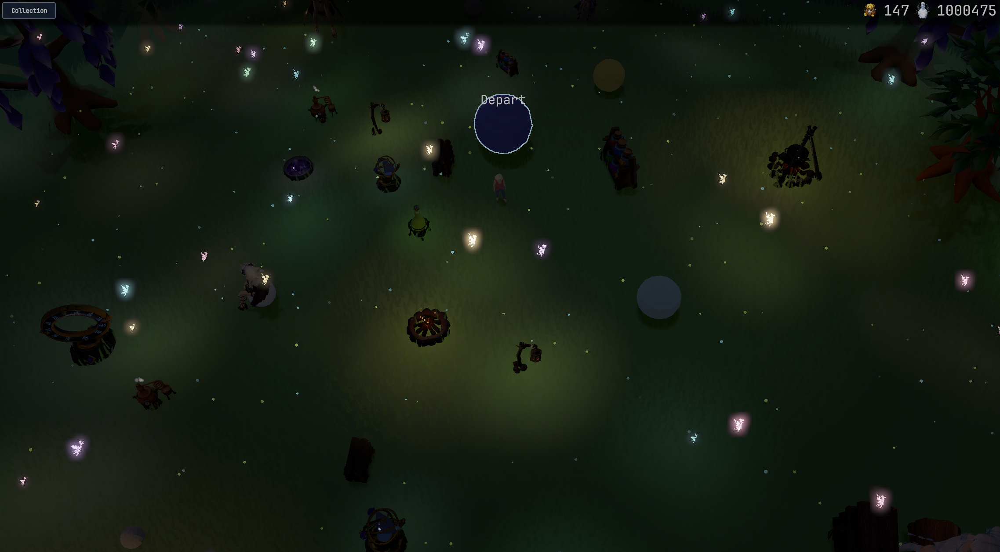

  

  A C++23 game engine built around Vulkan, Lua, and tools that grow out of a game in progress.

## Project status

> MLE is under active development. It is not a finished engine, a stable SDK, or a drop-in framework yet.

Most features are being built alongside a game rather than in isolation. Some systems already live in the engine, while others still sit on the game or test-client side until their shape is proven. They will move into MLE over time. Expect APIs, resource formats, and project layout to change.

Linux is the currently tested development platform. MLE is intended to work on Windows because its main dependencies are cross-platform, but Windows builds have not been tested yet. The helper scripts and a few compiler/linker settings are still Linux-oriented.

## In motion

### Model tests

<https://github.com/user-attachments/assets/ae60b8b8-0e75-4497-9bf5-92e2ad5f9415>

Interactive model viewer exercising glTF loading, skinned animation, cubemap backgrounds, camera controls, and multiple rendering modes.

### UI tests

<https://github.com/user-attachments/assets/9d4125bd-5d11-46eb-9f94-4d2127072869>

Interactive gallery for layout, scrolling, forms, popups, sprites, nine-slice panels, reusable Lua components, and native UI animation.

## What exists today

### Rendering

- Vulkan renderer using dynamic rendering.
- Swapchain and frame lifecycle management.
- Graphics, compute, and transfer queue support.
- Command pools, synchronization helpers, frame-local buffers, and deferred GPU-resource deletion.
- VMA-backed image and buffer wrappers with explicit layouts and queue ownership.
- SPIR-V shader loading and reflection for vertex inputs, descriptor sets, and push constants.
- Graphics and compute pipeline creation with shader and pipeline caches.
- Push descriptors, descriptor sets, push constants, indexed drawing, instancing, and compute dispatch.
- Off-screen render targets plus image copy, blit, blend, and composition operations.
- Texture, font, shader, pipeline, mesh, skeleton, and animation caches.
- Texture atlases and SDF font rendering.
- Asynchronous asset upload paths.
- Cubemap image loading and skybox rendering.
- HDR rendering, tonemapping, and presentation color correction.

### Models and animation

- glTF 2.0 loading through tinygltf.
- Static and skinned meshes.
- Color and textured PBR vertex formats.
- Materials with base color, emissive, metallic, and roughness data.
- Skeletons, skin bindings, animation clips, and animation evaluation.
- Model and animation resource selectors used by the interactive test client.
- Model-test render modes: PBR, cartoon, wireframe, normals, albedo, hologram, and flat projection.
- Orbit, pan, and zoom camera controls in the model test.
- Runtime cubemap background selection.

### Lua UI

- Retained-mode UI backed by EnTT entities and described in Lua tables.
- Named children, reusable styles, component composition, tags, IDs, and per-element state/functions.
- Vertical, horizontal, reversed, wrapping, packed, and free-position layouts.
- Pixel, relative, flexible, fit-content, anchor, margin, padding, border, origin, and sibling-dependent bounds.
- Scrollable containers, scroll state, clipping, and optional parent-scissor escape.
- Solid backgrounds, rounded borders, sprites, atlas UV regions, nine-slice panels, and render-image elements.
- SDF text with wrapping, justification, color, borders, placeholders, and visible-character control.
- Single-line and multiline text input, focus management, selection/caret display, submit/change callbacks, and programmatic input operations.
- Mouse, keyboard, hover, and scroll handlers.
- Create, update, destroy, resize, and custom event callbacks.
- Native tween tracks for scale, position, size, and color.
- Sprite-sheet and typewriter animation.
- Compute blur and custom Lua-configured shaders.
- Reusable Lua components including color picker, range slider, progress bars, filterable lists, dropdown selectors, carousel selector, multipanel, and scrollbars.
- Built-in performance and terminal debug layers.
- Interactive UI pages for animation, forms, inventory, popups, scrolling, filtering, sprites, and nine-slice rendering.

### Audio

- OpenAL audio engine running through a command mailbox.
- WAV loading through dr_libs.
- One-shot playback with priority-based voice allocation.
- Fixed stream slots, grouped stream startup, looping, pause, resume, stop, and stop-all commands.
- Per-stream volume and pitch changes.
- Start offsets, bounded durations, fade-in, and fade-out.
- Eight volume buses with voice limits and protection policies.
- Spatial and non-spatial source-state handling.
- Lua bindings and an interactive audio test layer.

Listener and distance-control commands exist but are not complete yet; 3D audio should be treated as unfinished.

### Runtime and platform

- SDL3 window creation and event handling.
- Keyboard and mouse input with prioritized listeners.
- Text-input routing and focus-aware key handling.
- Resize and close events.
- Layer-based client loop with game and debug-layer composition.
- LuaJIT runtime with sol2 bindings for engine, math, UI, input, and audio data.
- C++23 core with exceptions and RTTI disabled.
- <code>Result</code>/<code>Expected</code>-based error handling.
- spdlog logging, compile-time log filtering, assertions, runtime configuration, and configuration listeners.
- Thread pool, performance tracking, timers, thread-safe queues, and locked-data helpers.
- GLM-backed 2D/3D math, rectangles, intersection helpers, and JSON/Lua conversion.
- UTF-8/UTF-32 conversion through ICU and utfcpp.
- General utilities for colors, hashing, IDs, RNG, file access, flags, ECS helpers, and rectangle packing.

### Tests, tools, and documentation

- GoogleTest Core suite covering engine utilities and subsystems.
- Interactive Client with Model, UI, and Audio test layers.
- Shader compilation helpers using <code>glslangValidator</code>.
- Doxygen generation support.
- <code>MLECubes</code>, an early voxel-asset tool under <code>tools/</code>.
- Early fixed-timestep server and communication scaffolding. Networking and multi-client behavior are not production-ready.

## Building

### Requirements

- Git
- CMake 3.16 or newer
- C++23-capable compiler; Clang is preferred
- Vulkan SDK and a Vulkan-capable driver
- ICU development libraries
- OpenAL development libraries
- GNU Make for building LuaJIT
- <code>glslangValidator</code> for compiling shaders
- Bash for the project helper commands

Dependencies kept as git submodules include SDL3, LuaJIT, sol2, GLM, EnTT, spdlog, SPIRV-Reflect, stb, tinygltf, cereal, utfcpp, and dr_libs.

### Recommended setup

Run from repository root:

~~~bash
git clone https://github.com/MaxMFonseca/MLE.git
cd MLE

source scripts/envsetup.sh
mle_setup
mle_config -t Debug
mle_build -t Debug
~~~

<code>mle_setup</code> initializes submodules and builds LuaJIT. <code>mle_config</code> creates <code>build/Debug</code>. <code>mle_build</code> compiles shaders before building MLE and enabled test targets.

Release build:

~~~bash
source scripts/envsetup.sh
mle_config -t Release
mle_build -t Release
~~~

Useful configuration options:

~~~bash
# Build engine without test targets
mle_config -t Release -- -DMLE_BUILD_TESTS=OFF

# Enable Doxygen configuration
mle_config -t Debug -- -DMLE_ENABLE_DOXYGEN=ON
~~~

### Plain CMake

Helper scripts are preferred because they compile shaders and prepare resource links. For build-system integration, equivalent core steps are:

~~~bash
git submodule update --init --recursive
make -C external/LuaJIT

cmake -S . -B build/Debug \
  -DCMAKE_BUILD_TYPE=Debug \
  -DCMAKE_EXPORT_COMPILE_COMMANDS=ON

cmake --build build/Debug -j
~~~

Compiled SPIR-V files are present in the repository, but shader changes require <code>mle_compile_shaders_all</code> or an equivalent <code>glslangValidator</code> invocation.

## Running

Load helper commands first:

~~~bash
source scripts/envsetup.sh
~~~

Build and launch the interactive Client:

~~~bash
mle_ber -n Client -t Debug
~~~

Launch an already-built Client:

~~~bash
mle_run_test -n Client -t Debug
~~~

Run Core unit tests:

~~~bash
mle_run_test -n Core -t Debug
~~~

Arguments after <code>--</code> are forwarded to the selected executable:

~~~bash
mle_run_test -n Core -t Debug -- --gtest_filter=AnimationTest.*
~~~

The Client opens a menu for Model Test, UI Test, and Audio Test.

## Repository map

~~~text
src/mle/
  audio/      OpenAL playback, streaming, buses, and voice allocation
  client/     Application loop and composited layers
  core/       Startup, logging, results, config, threads, and performance
  lua/        LuaJIT state and C++/Lua bindings
  math/       GLM-backed math and intersection helpers
  renderer/   Vulkan resources, pipelines, caches, models, and frames
  server/     Experimental server scaffolding
  ui/         EnTT-backed Lua UI
  utils/      Shared containers and utilities
  window/     SDL3 window, input, and text handling

res/          Engine shaders, Lua, models, fonts, textures, and sounds
tests/Core/   GoogleTest suite
tests/Client/ Interactive engine test application
tools/        Engine-based tools
scripts/      Build, shader, test, and documentation helpers
~~~

  

  <em>Scene from the game being developed alongside MLE. Engine integration is ongoing. A Steam page is coming soon; more of the game will be shown once it is public.</em>

